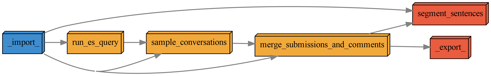

# `podlm` Probabilistic Opinion Dynamics with Language Models

# Overview

This repo contains all the code for the "Probabilistic Opinion Dynamics with Language Models project," aka `podlm`. This is a SSHRC-funded research project led by Dr. John McLevey (PI) with Drs. David Tindall, Darrin Durant, Anabel-Quan-Haase as co-investigators, Tyler Crick (ABD) as the lead Research Assistant / Data Scientist, and Research Assistants Karmvir Padda and Romina Hashemi. 

This README is a work in progress. Eventually it will be a comprehensive guide to the project, but I've got to bow out early because... the twins are coming!

In short, 

- the `curry` package is a command-line interface (CLI) for running the `pdpp` pipeline and storing results for further analysis (in the `analyses/` directory).
- the `podlm` package contains ~90% the code for the `pdpp` pipeline itself, which is a series of carefully coordinated steps that take raw data and produce a set of labelled conversations.
- the `pipeline` directory contains all the steps of the pipeline. It's a `pdpp` project within the larger project repo. John and Tyler are the primary contributors to this part of the project, but Romina will almost certainly be involved in some tasks (e.g., classifying time orientation with few shot learning, etc.). Tyler will "supervise" Romina on this work while John is on parental leave. 
- the `environments` directory contains `yaml` files for creating the environments used in this project. **Note that the pipeline can't run with a single `env` due to some tough incompatibilities (e.g., between `graph-tool` and `pytorch`). Unfortanately, it is currently necessary to toggle between the `podlm` and `gt` environments to run the pipeline.** `gt` is only needed for the network-based tasks, `podlm` is good for the rest.
- The contents of the `prototyping` directory are ignored by `git`, so you can have whatever you want in there and there will never be a merge conflict. This is where you can prototype new ideas, etc.

# Running / Preparing Analyses with `curry`

To start a new analysis, initialize an analysis directory with `curry init`. For example, to initialize an analysis directory called `mclevey_20231031_rebuilding_pipeline`, we can supply the keywords "rebuilding pipeline":

```bash
curry init "rebuilding pipeline"
```

Or, equivalently:

```bash
curry init rebuilding_pipeline
```
 
The next step is to edit the analysis config file in the root of your analysis directory, e.g., `analyses/mclevey_20231031_rebuilding_pipeline/config.yaml`. For example, here's one I've been prototyping with:

```yaml
analysis_id: mclevey_20231031_rebuilding_pipeline
subreddits: [harmreduction]
sample_n_conversations: 500
# label_entities
entity_score_threshold: 0.75
# label_topics
umap_n_neighbors: 15
umap_n_components: 5
hdbscan_min_cluster_size: 15
mmr_model_diversity: 0.3
sentence_transformer_model: "all-MiniLM-L6-v2"
```

Once you've finished with `config.yaml`, you can run the pipeline by supplying `curry run` with the path to the analysis directory. 

```bash
curry run analyses/mclevey_20231031_rebuilding_pipeline
```

It will take some time for the pipeline to run. When it finsihes, the contents of `pipeline/_export_/` will be filed in `analyses/<ANALYSIS_DIR_NAME>/_import_/results`.

**There will be errors** due to package incompatibilities. To resolve them, you need to toggle between the `podlm` and `gt` environments. We are working on a way to smooth this out. Stay tuned!

## Config Files

The pipeline needs two config files to run:

1. The config file in your analysis directory, e.g. `analyses/mclevey_20231031_rebuilding_pipeline/config.yaml`, and
2. The `private.yaml` config file in the root directory of the project, which contains sensitive information like credentials and does **not** get committed to the repository.

`private.yaml` should look something like this:

```yaml
es_host: '<HOST>'
es_verify_certs: <BOOL>
```

The pipeline will automatically load `private.yaml` as long as it exists in the project root directory. 

# `pdpp` Pipeline

`curry` keeps this depedency graph updated by running

```bash
cd pipeline && pdpp graph --files 'png' --style 'default'
```

everytime it executes the pipeline. 



You can always find the up to date dep graph in the relevant analysis directory too, in `pipeline_dependencies/`. 

# Environments

You can find `yaml` files to create the environments used in this project in `environments/`.

To generate a `yaml` file with the contents of the `podlm` virtual environment, for example: 

```bash
conda env export > environments/podlm.yml
```

To create a new environment from a `yaml` file, for example `podlm_the_second` from a file called `podlm_the_second.yml`:

```bash
conda env create -f environments/podlm_the_second.yml
```

`podlm` is not on conda-forge or pip, so you'll need to install it in the new environment. Make sure you activate the environment first: 

```bash
conda activate podlm
pip install -e podlm/
```

More from me soon. Time to start twinning...
