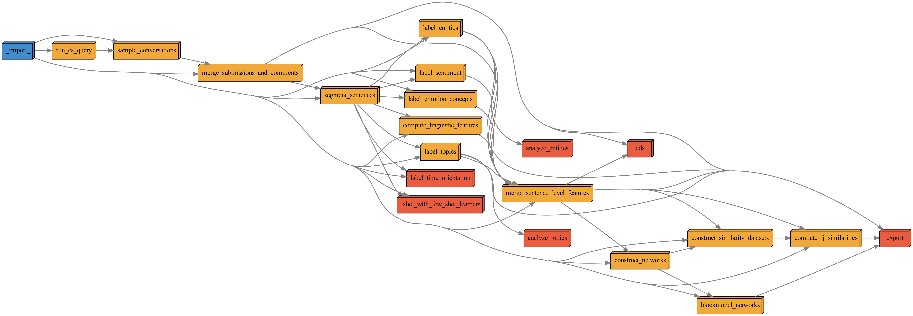

# `podlm` Probabilistic Opinion Dynamics with Language Models

# Overview

# Preparing Analyses

To start a new analysis, initialize an analysis directory with `curry init`. For example, to initialize an analysis directory called `mclevey_20231031_rebuilding_pipeline`, we can supply the keywords "rebuilding pipeline":

```bash
curry init "rebuilding pipeline"
```

Or, equivalently:

```bash
curry init rebuilding_pipeline
```
 
The next step is to edit the analysis config file in the root of your analysis directory, e.g., `analyses/mclevey_20231031_rebuilding_pipeline/config.yaml`. Once you've finished with `config.yaml`, you can run the pipeline by supplying `curry run` with the path to the analysis directory. 

```bash
curry run analyses/mclevey_20231031_rebuilding_pipeline
```

It will take some time for the pipeline to run. When it finsihes, the contents of `pipeline/_export_/` will be filed in `analyses/<ANALYSIS_DIR_NAME>/_import_/results`.

## Config Files

The pipeline needs two config files to run:

1. The config file in your analysis directory, e.g. `analyses/mclevey_20231031_rebuilding_pipeline/config.yaml`, and
2. The `private.yaml` config file in the root directory of the project, which contains sensitive information like credentials and does **not** get committed to the repository.

The pipeline will automatically load `private.yaml` as long as it exists in the project root directory.

# `pdpp` Pipeline

`curry` keeps this depedency graph updated by running

```bash
cd pipeline && pdpp graph --files 'png' --style 'default'
```

everytime it executes the pipeline. 



# Environments

You can find `yaml` files to create the environments used in this project in `environments/`.

To write a new environment called `entities.yml`, for example: 

```bash
conda env export > environments/entities.yml
```

To create a new environment from a `yaml` file, for example `entities` from `entities.yml`:

```bash
conda env create -f environments/entities.yml
```


# Packages

## `curry`

## `podlm`


